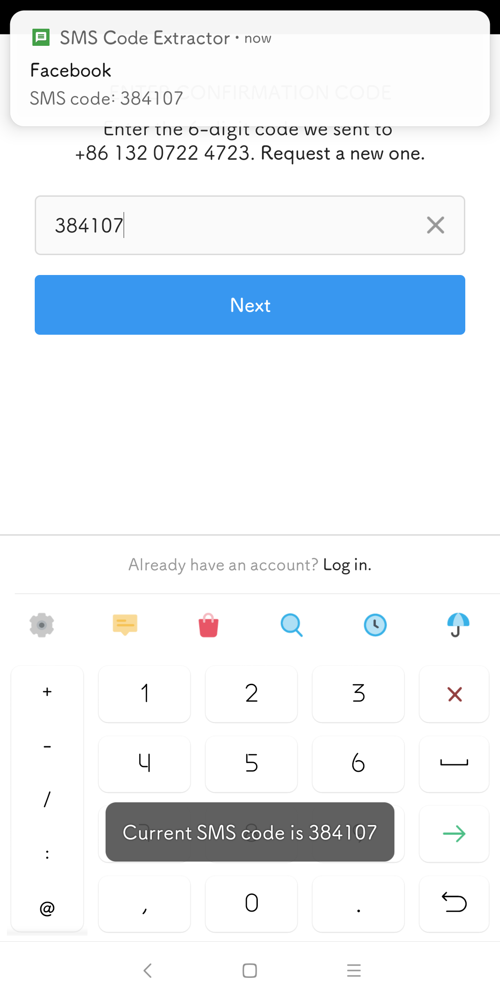
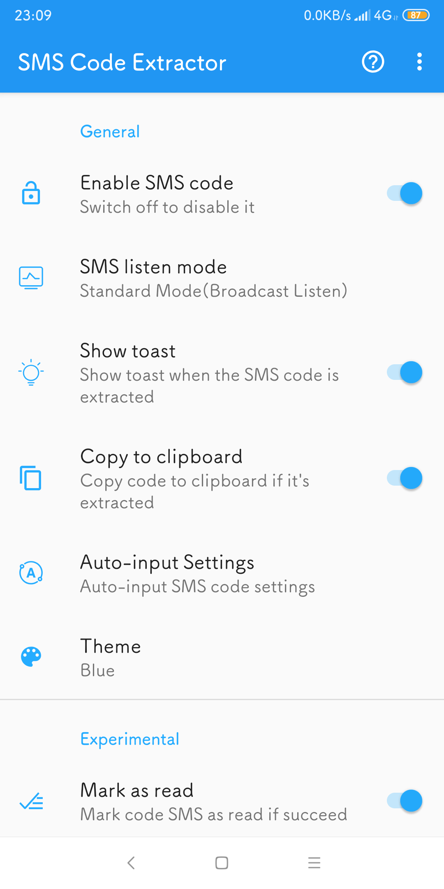
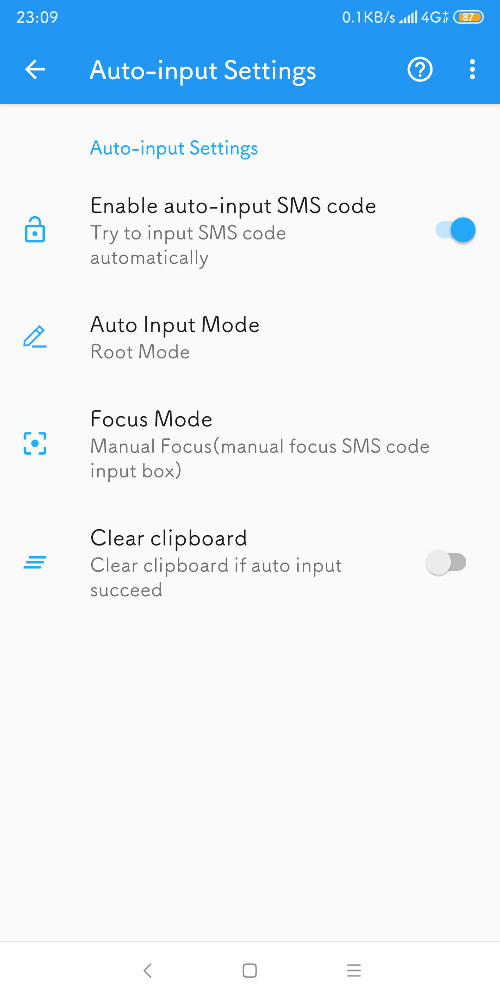
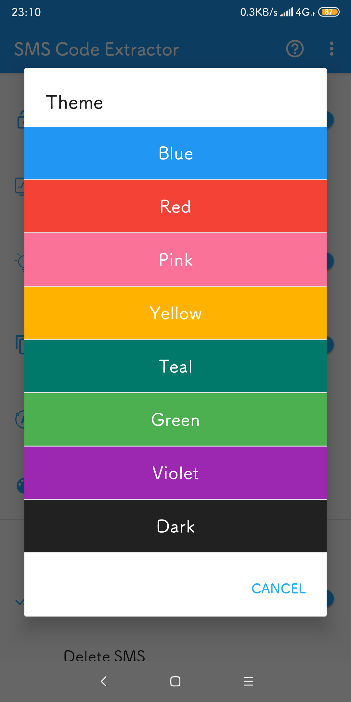

# SmsCodeExtractor
SmsCodeExtractor is non-xposed version of [XposedSmsCode](https://github.com/tianma8023/XposedSmsCode)。 It can recognize, parse SMS code and copy it to clipboard when a new message arrives, it can also auto-input SMS code.

# Screenshots

You can download the latest App from [Coolapk](https://www.coolapk.com/apk/com.github.tianma8023.smscode) or [releases](https://github.com/tianma8023/SmsCodeExtractor/releases/).

# Features
- Copy verification code to clipboard when a new message arrives.
- Show toast when a SMS verification code is copied.
- Custom keywords about verification code message (regular expressions allowed).
- Auto-input SMS code.
- Various theme color to choose.

# Attention
- **This module is suitable for AOSP ROM, it may not work well on other 3rd-party Rom.**
- **Compatibility: Requires Android 4.4+ (api level ≥ 19).**
- **Read the FAQ in app first if you encountered any problems.**

# Update Logs
[Update logs](/LOG-EN.md)

# Thanks
- [drakeet SmsCodeHelper](https://github.com/drakeet/SmsCodeHelper)
- [zhidao8 SmsCodeHelper](https://github.com/zhidao8/SmsCodeHelper)
- [AndPermission](https://github.com/yanzhenjie/AndPermission)
- [ButterKnife](https://github.com/JakeWharton/butterknife)
- [Material Dialogs](https://github.com/afollestad/material-dialogs)
- [Android Shell](https://github.com/jaredrummler/AndroidShell)
- [logback-android](https://github.com/tony19/logback-android)
- [Bugly](https://bugly.qq.com)

# License
All code is licensed under [GPLv3](https://www.gnu.org/licenses/gpl-3.0.txt) 