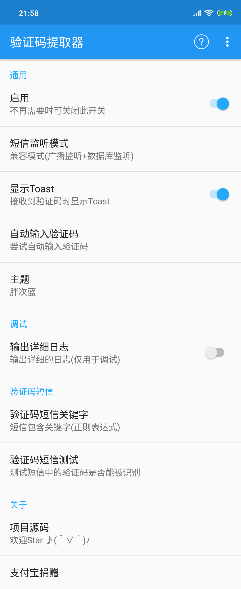

# SmsCodeExtractor
识别短信验证码的App，是 [XposedSmsCode](https://github.com/tianma8023/XposedSmsCode) 的普通（非Xposed）版本。能识别短信中验证码，并将其拷贝至系统剪切板，亦可以自动输入验证码。

[English Version](/README-EN.md)

# 应用截图

可以从 [酷安](https://www.coolapk.com/apk/com.github.tianma8023.smscode) 或者 [releases](https://github.com/tianma8023/SmsCodeExtractor/releases/) 下载最新的App。

# 已有功能
- 收到验证码短信后将验证码复制到系统剪贴板
- 当验证码被复制后显示Toast
- 自定义验证码短信关键字（正则表达式）
- 自动输入验证码
- 主题换肤

# 注意
- **因为使用到无障碍服务和广播接收者等系统组件，在某些深度定制的ROM上可能不适用（已知如华为的 EMUI）**
- **兼容性：兼容 Android 4.4及以上（api等级≥19）设备。**
- **遇到什么问题请先看App内的“常见问题”**

# 更新日志
[更新日志](/LOG-CN.md)

# 感谢
- [drakeet SmsCodeHelper](https://github.com/drakeet/SmsCodeHelper)
- [zhidao8 SmsCodeHelper](https://github.com/zhidao8/SmsCodeHelper)
- [AndPermission](https://github.com/yanzhenjie/AndPermission)
- [ButterKnife](https://github.com/JakeWharton/butterknife)
- [Material Dialogs](https://github.com/afollestad/material-dialogs)
- [Android Shell](https://github.com/jaredrummler/AndroidShell)
- [logback-android](https://github.com/tony19/logback-android)
- [Bugly](https://bugly.qq.com)

# 协议
所有的源码均遵循 [GPLv3](https://www.gnu.org/licenses/gpl-3.0.txt) 协议